# Lab-7-FragmentExample

### FragmentExample1 Application Overview

- Application Index Potrait
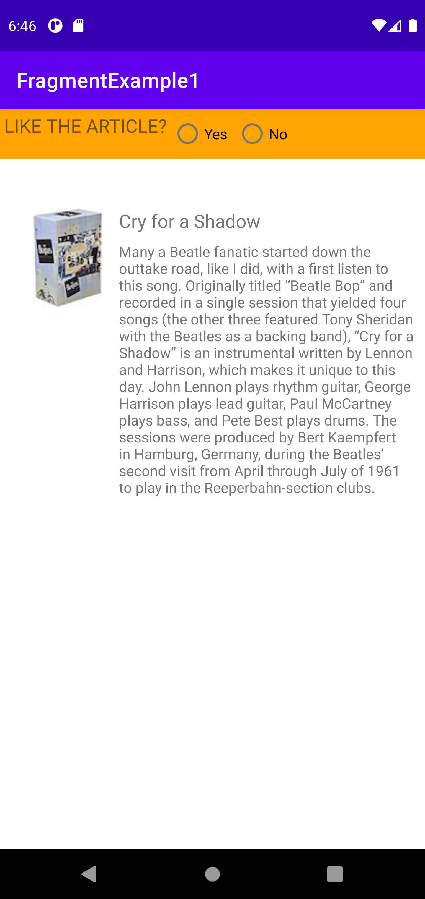

- Application Index Landscape

### FragmentExample1 Application Workings

- Yes Radio Button Potrait

- Yes Radio Button Landscape

- No Radio Button Potrait
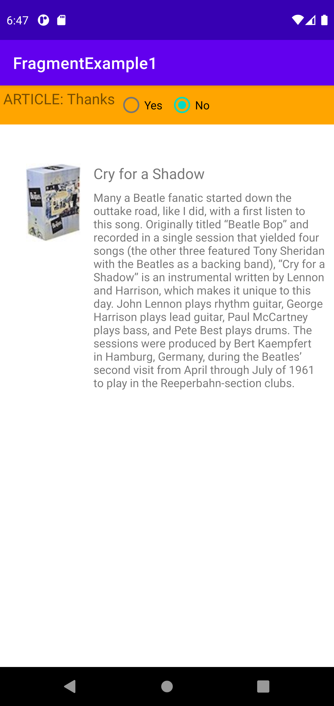

- No Radio Button Landscape
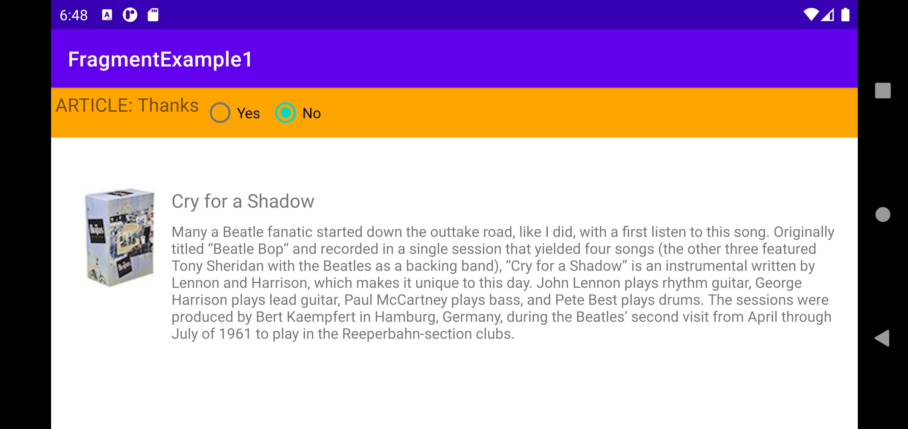

### FragmentExample2 Application Overview

- Application Index Potrait
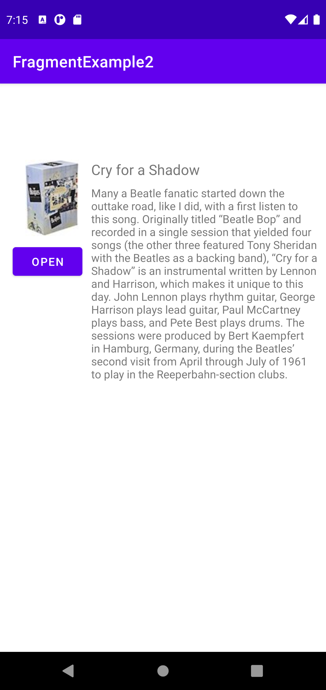

- Application Index Landscape
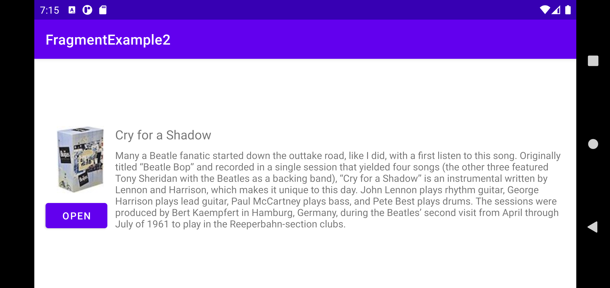

### FragmentExample2 Application Workings

- Open Button Potrait
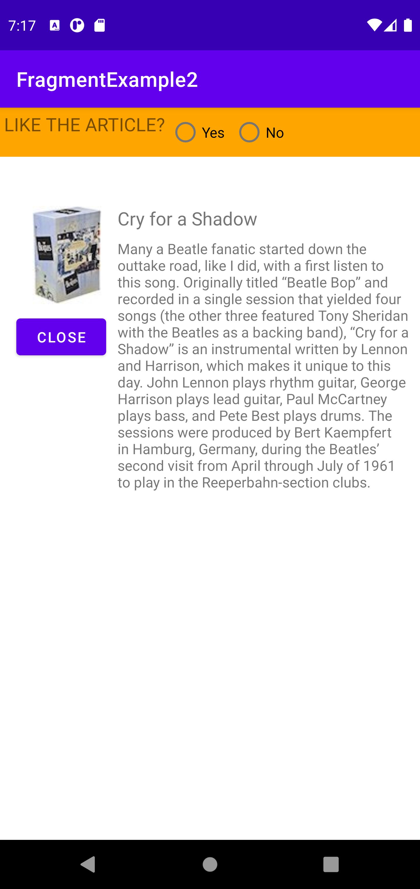

- Open Button Landscape
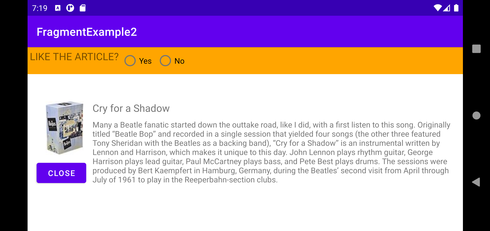

- Close Button Potrait

- Close Button Landscape

- When Open Button Potrait
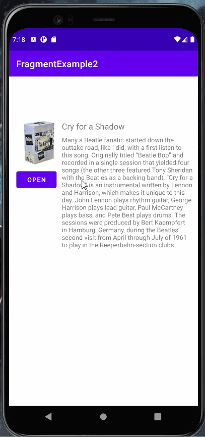

- When Open Button Landscape
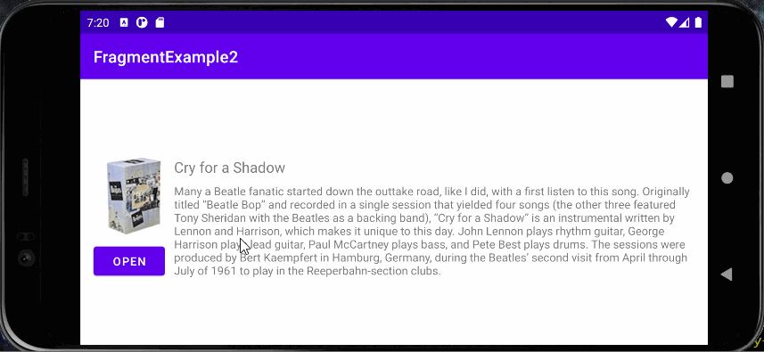

# FragmentExample1-Challenge

### FragmentExample1-Challenge Application Overview

- Application Index 

### FragmentExample1-Challenge Application Workings

- Yes Radio Button Potrait
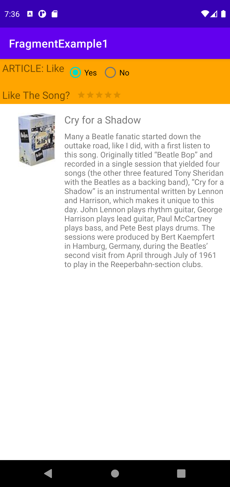

- No Radio Button Potrait
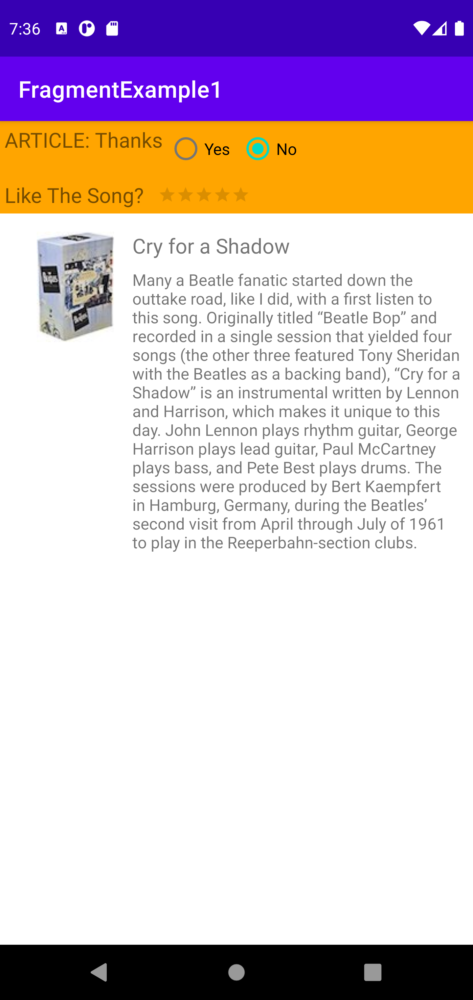

- When Rating Bar is Used
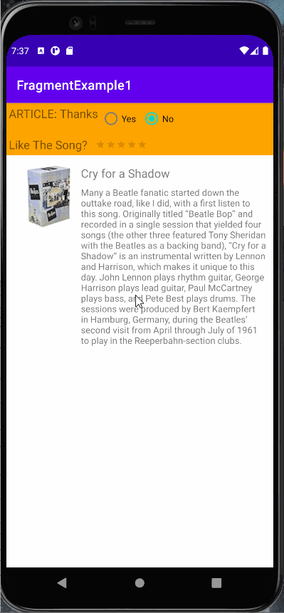

# FragmentExample2-Homework

### FragmentExample2-Homework Application Overview

- Application Main Index 

- Application Second Index 
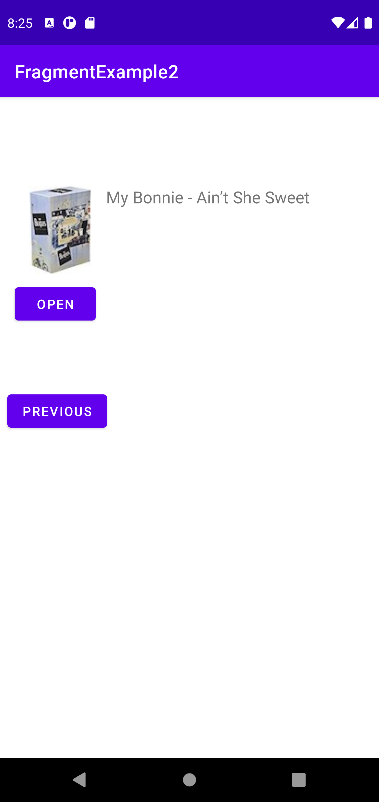

### FragmentExample2-Homework Application Workings

- Open Button

- Close Button
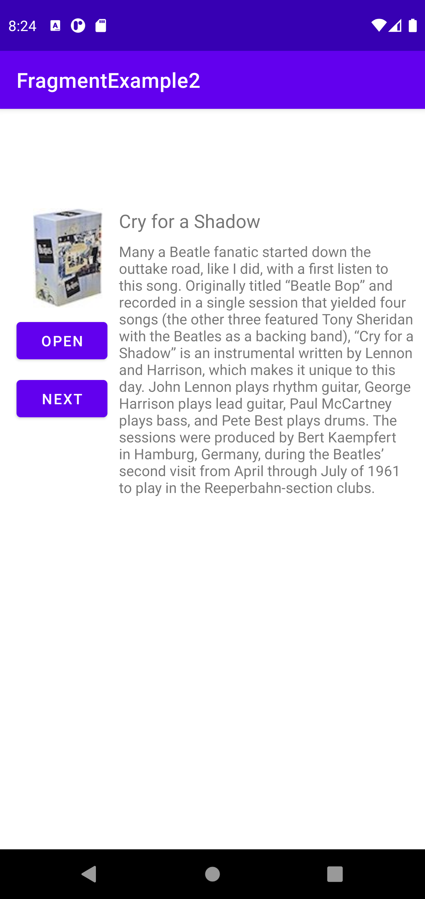

- Yes Radio Button
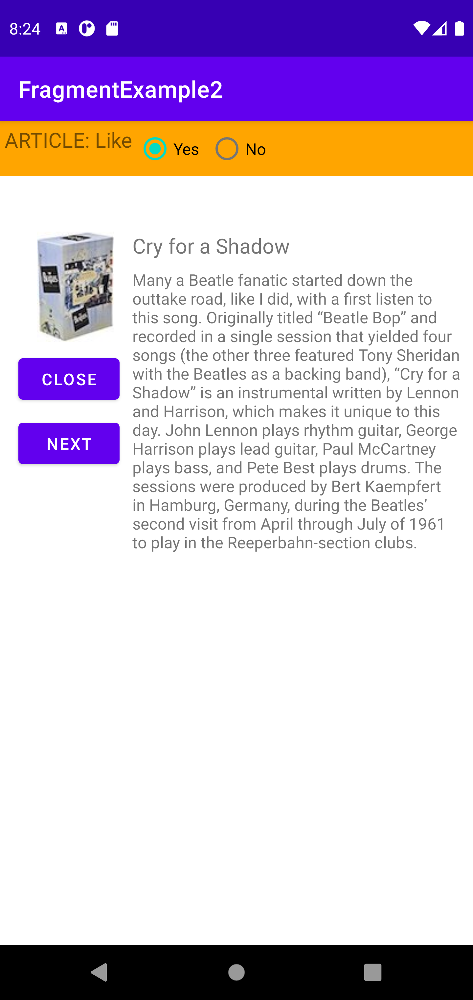

- No Radio Button
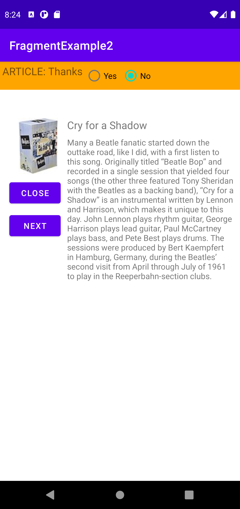

- When Next Button is Used
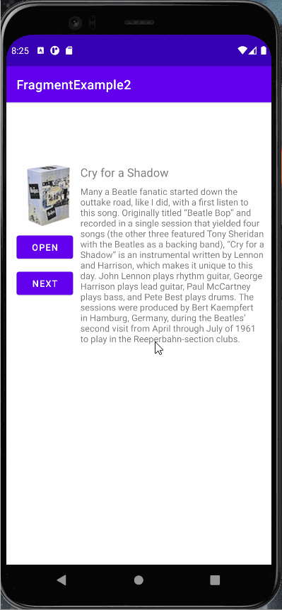

- When Previous Button is Used
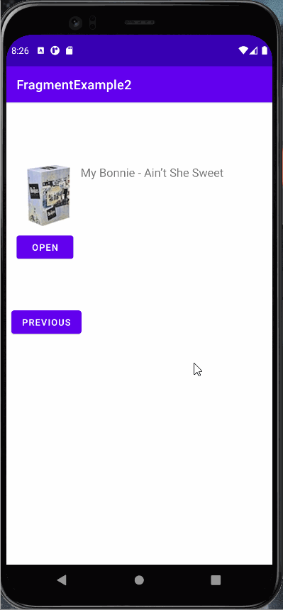

